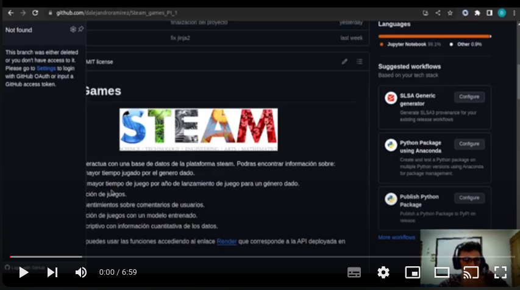

# Steam Games

<p align="center">
  
</p>
Este proyecto interactua con una base de datos de la plataforma steam. Podras encontrar información sobre:

- El año con mayor tiempo jugado por el genero dado.
- Usuario con mayor tiempo de juego por año de lanzamiento de juego para un género dado.
- Recomendación de juegos.
- Analisis de sentimientos sobre comentarios de usuarios.
- Recomendación de juegos con un modelo entrenado.
- Analisis descriptivo con información cuantitativa de los datos.

**NOTA**: También puedes usar las funciones accediendo al enlace [Render](https://proyecto-1-2019.onrender.com/docs) que corresponde a la API deployada en Render.

## Contenido

1. [Introducción](#introducción)
2. [Configuración](#configuración)
3. [Uso](#uso)
4. [Estructura del Proyecto](#estructura-del-proyecto)
5. [Video](#video)
6. [Contacto](#contacto)
7. [Tecnologías Utilizadas](#tecnologías-utilizadas)

## Introducción

- Bienvenidos y bienvenidas a esta api con información de juegos, y jugadores de steam. Steam es una plataforma de distribución digital de videojuegos desarrollada por Valve Corporation. Fue lanzada en septiembre de 2003 como una forma para Valve de proveer actualizaciones automáticas a sus juegos.

- El objetivo de esta api es realizar consultas a una base de datos se juegos, jugadores y reviews de steams. La persona que entre a esta página podra realizar diferentes consultas referentes a los jugadores, generos y un analisis de recomendación aplicando técnicas de similitud de texto que permiten realizar clustering de juegos similares.

- Si deseas replicar este proyecto, solo debes clorar el repositorio, crear un entorno virtual con las libreria requeridas en requirements.txt. Luego utilizando uvicorn y fastapi, podras realizar un deploy del propio proyecto.

- Cada uno de los endpoints del proyecto se encuentran documentados en la carpeta 03_Endpoints, aqui podras crear la tabla consumida por el api y la construcción de la función consumible.

- Los datos se encuentran en csv.gz, ya que por cuestiones de proyecto no tenemos memoria suficiente para crear una base de datos en mysql.
 

## Configuración
- Para poder replicar este proyecto deberas clonar el repositorio, luego crear un entorno virtual ya sea un entorno de python, docker ó anacondas. Instalas los requerimientos necesario para en el archivo requirements.txt.

- El archivo principal se llama main.py en el encontraras las funciones que realizamos en este proyecto, ademas, encontraras en la carpeta **03_Endpoints**  explicación detallada de la construcción de cada función.


## Uso
Dentro del entorno de ejecución de fastapi encontraras los endpoints requeridos para este proyecto:

* [`/play_time_genre`: 
](https://github.com/dalejandroramirez/Steam_games_PI_1/blob/master/03_Endpoints/01_play_time_genres.ipynb): 
 Calcula el año con mayor tiempo jugado por el genero dado. 
 
* [user_for_genre](https://github.com/dalejandroramirez/Steam_games_PI_1/blob/master/03_Endpoints/02_user_for_genres.ipynb): Dado un genero. Debe retornar el usuario que acumula más horas jugadas para el género dado y una lista de la acumulación de horas jugadas por año de lanzamiento del juego. 

* [`/user_recommned`](https://github.com/dalejandroramirez/Steam_games_PI_1/blob/master/03_Endpoints/03_users_recommend.ipynb) : Dado un año, devuelve el top 3 de juegos MÁS recomendados por usuarios para el año dado. 

* [`/user_not_recommend`](https://github.com/dalejandroramirez/Steam_games_PI_1/blob/master/03_Endpoints/04_users_not_recommend.ipynb) : Dado un año, devuelve el top 3 de juegos MENOS recomendados por usuarios para el año dado. 

* [`/sentiment_Analysis`](https://github.com/dalejandroramirez/Steam_games_PI_1/blob/master/03_Endpoints/05_sentiment_analysis.ipynb): Dado un año de lanzamiento, devuelve una lista con la cantidad de registros de reseñas de usuarios que se encuentren categorizados con un análisis de sentimiento. 

* [`/recomendacion_juego`](https://github.com/dalejandroramirez/Steam_games_PI_1/blob/master/03_Endpoints/05_sentiment_analysis.ipynb) : Ingresando el id de producto, deberíamos recibir una lista con 5 juegos recomendados similares al ingresado. 

**NOTAS**:

- También puedes usar las funciones accediendo al enlace https://proyecto-1-2019.onrender.com/docs, que corresponde a la API deployada en Render.

- `/recomendacion_juego_v2` Este endpoint es una versión alternativa del analisis de sentimiento, la estrucutura de este endpoint facilita recorta el tiempo de espera de la respuesta del endpoint. En ambos casos se trabajo con los todos los usuarios, la única diferentecia es que en este último catalogamos los juegos por sus generos más significativos, especificamente por el top 10 de generos mas repetidos.

## Estructura del Proyecto

En este repositorio podras encontrar la siguiente estructura.
- [data](https://github.com/dalejandroramirez/Steam_games_PI_1/tree/master/data): Encontraras dos carpetas, raw y clear. En la carpeta raw se encuetra la data cruda y sin tratamientos inciales, mientras que en la carpeta clear encontraras la data tratada para poder trabajar con ella de manera eficiente, ademas de tener las tablas requeridas para cada consulta.
- [01_Transformacion](https://github.com/dalejandroramirez/Steam_games_PI_1/tree/master/01_Transformacion): Encontraras las transformaciones preliminares que realizamos en la base de  datos para la correcta manipulación de los archivos. Ademas una carpeta llamanda **funciones_aux**, esta carpeta fue diseñada para ser un modulo de python lo que permitirá escalabilidad del nootbook en caso de necesitar creación de nuevas consultas.

- [02_Eda](https://github.com/dalejandroramirez/Steam_games_PI_1/tree/master/02_Eda)En esta carpeta encontraras un etl simple sobre algunas métricas importante que podemos destactar en el proyecto, aclaro que por cuestiones de entrega, se realizó un etl sencillo, el objetivo en una siguiente versión es renderizar estas vizualizaciones de una mejor manera.

- [03_Endpoints](https://github.com/dalejandroramirez/Steam_games_PI_1/tree/master/03_Endpoints) : En esta carpeta encontraras cada una de las funciones que se realizaron en este proyecto, en diferentes nootbook, ademas de la creación de la tabla consulta,  se realiza una explicación detallada del analisis de cada función asi como un ejemplo ilustrativo de la respuesta de cada endpoint.
- [routers](https://github.com/dalejandroramirez/Steam_games_PI_1/tree/master/routers) En esta carpeta encontraras las funciones ya listas para ser consumidas por la api.
- [main.py](https://github.com/dalejandroramirez/Steam_games_PI_1/blob/master/main.py)  Este es el archivo principal en el que se encuentra condensado toda la lógica que sera consumida por la API.


# Video
[](https://youtu.be/FuRSFwK7G9Q)


# Contacto
Daniel Alejandro Ramírez Gómez.

- LinkedIn: [dalejandro.ramirez.dev](https://www.linkedin.com/in/daniel-alejandro-ram%C3%ADrez-g%C3%B3mez-704616229/)

- Correo electrónico: dalejandro.ramirez.dev@gmail.com

## Tecnologías Utilizadas
Python | Pandas | Matplotlib | Seaborn | Scikit-Learn | nltk | FastAPI | Render | Jinja2 


```bash
pip install -r requirements.txt
